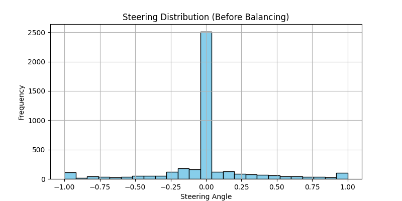
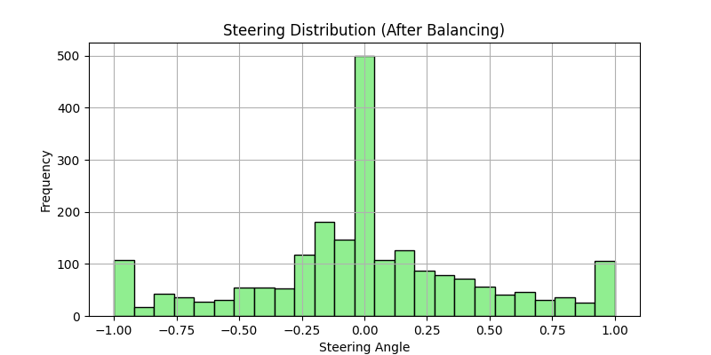
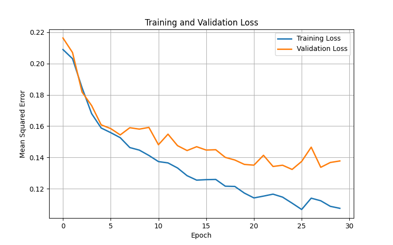

# SelfDrivingCarBehavioralCloning – Training Report

This document summarizes the data distribution, model training process, and final results.

---

## 1. Steering Angle Distribution

A balanced dataset is crucial to avoid the model always predicting “straight” steering.  
Below are the histograms **before** and **after** balancing the dataset.

### Before Balancing

### After Balancing

---

## 2. Training Loss Plot

The plot below shows the model’s training and validation loss over epochs.  
Early stopping was used to prevent overfitting.

---

## 3. Observations

* The original dataset had a strong bias toward straight driving.
* After balancing, the distribution became more even, improving model generalization.
* Training loss decreased steadily, and validation loss stabilized early, showing good generalization.

---

## 4. Model Performance

* Successfully navigated the Udacity Simulator’s first track without leaving the road.
* Handles turns and curves much better after balanced training data.
* Minimal steering jitter compared to early model versions.
